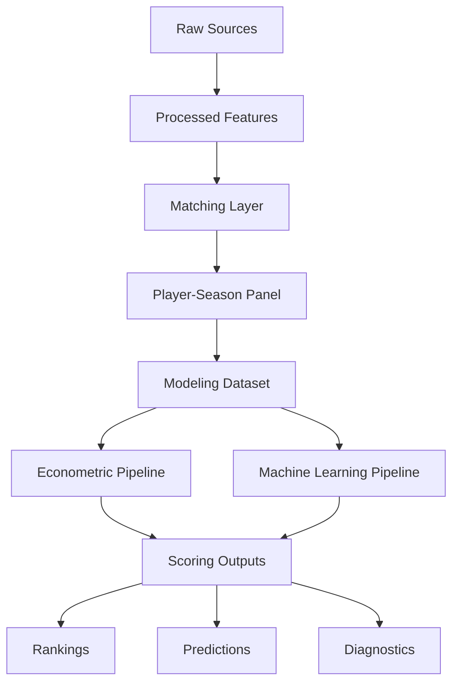
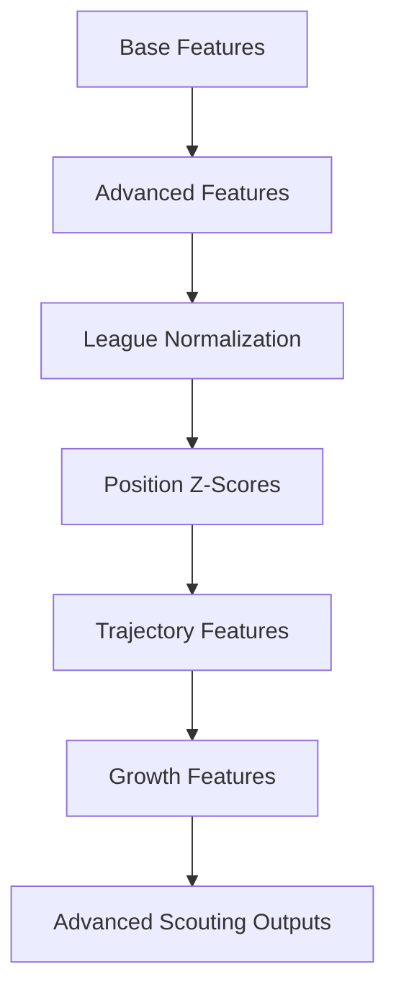

# 🏗️ Decisiones de esquema y modelado de datos

<div align="center">


</div>

---

# 📑 Tabla de contenidos

- [🧠 Objetivo del documento](#-objetivo-del-documento)
- [🏗️ Filosofía de diseño](#️-filosofía-de-diseño)
- [⚙️ Unidad de análisis](#️-unidad-de-análisis)
- [📊 Estructura conceptual del sistema](#-estructura-conceptual-del-sistema)
- [📂 Arquitectura física de datos](#-arquitectura-física-de-datos)
- [📦 Separación entre capas](#-separación-entre-capas)
- [📥 Esquema de datos raw](#-esquema-de-datos-raw)
- [🧪 Esquema de datos procesados](#-esquema-de-datos-procesados)
- [🔗 Esquema de integración y matching](#-esquema-de-integración-y-matching)
- [📊 Esquema del modeling dataset](#-esquema-del-modeling-dataset)
- [🏷️ Diseño de variables categóricas](#️-diseño-de-variables-categóricas)
- [📈 Diseño de variables numéricas](#-diseño-de-variables-numéricas)
- [📊 Diseño del target](#-diseño-del-target)
- [📂 Separación entre dataset y outputs](#-separación-entre-dataset-y-outputs)
- [💡 Variables derivadas y scoring](#-variables-derivadas-y-scoring)
- [🛡️ Prevención de leakage](#️-prevención-de-leakage)
- [⏳ Diseño temporal](#-diseño-temporal)
- [📦 Gestión de artefactos](#-gestión-de-artefactos)
- [⚙️ Configuración centralizada](#️-configuración-centralizada)
- [⚖️ Trade-offs metodológicos](#️-trade-offs-metodológicos)
- [🚀 Evolución prevista del esquema](#-evolución-prevista-del-esquema)
- [🧠 Conclusión](#-conclusión)

---

# 🧠 Objetivo del documento

Este documento describe las decisiones de diseño del esquema de datos utilizadas en el sistema analítico orientado a:

<pre>
identificar jugadores infravalorados en el mercado de fichajes europeo
</pre>

El objetivo es documentar:

- estructura lógica del dataset
- arquitectura de almacenamiento
- diseño de variables
- separación entre capas
- control de leakage
- consistencia temporal
- decisiones de analytics engineering

---

# 🏗️ Filosofía de diseño

El diseño del sistema sigue principios de:

- modularidad
- reproducibilidad
- trazabilidad
- desacoplamiento
- mantenibilidad
- escalabilidad futura

---

## Principio central

Separar explícitamente:

- datos fuente
- datasets procesados
- datasets modelizables
- outputs derivados
- artefactos de modelos

---

## Objetivo

Evitar:

- contaminación entre etapas
- leakage accidental
- dependencia de notebooks
- mezcla entre lógica y outputs

---

# ⚙️ Unidad de análisis

La unidad de análisis principal es:

<pre>
Jugador – Temporada
</pre>

---

## Justificación

Esta estructura permite:

- coherencia temporal
- integración multi-fuente
- modelización longitudinal
- comparabilidad entre jugadores
- validación temporal

---

## Implicaciones metodológicas

Cada fila representa:

- un jugador
- en una temporada concreta
- dentro de un contexto competitivo específico

---

# 📊 Estructura conceptual del sistema



---

# 📂 Arquitectura física de datos

```text
data/

├── raw/
├── interim/
├── processed/
└── external/
```

---

## 📌 Objetivo de separación

| Capa      | Función                          |
| --------- | -------------------------------- |
| raw       | Datos originales                 |
| interim   | Datos parcialmente transformados |
| processed | Datasets finales reutilizables   |
| external  | Datos auxiliares externos        |

---

# 📦 Separación entre capas

La arquitectura separa explícitamente:

| Elemento      | Directorio        |
| ------------- | ----------------- |
| Datasets      | `data/processed/` |
| Outputs       | `reports/`        |
| Artefactos    | `artifacts/`      |
| Configuración | `config/`         |
| Lógica        | `src/`            |

---

## Beneficios

Esta separación mejora:

* mantenibilidad
* trazabilidad
* auditoría
* reproducibilidad
* control de leakage

---

# 📥 Esquema de datos raw

## Objetivo

Mantener los datos originales lo más cercanos posible a la fuente.

---

## Características

* mínima transformación
* persistencia original
* trazabilidad
* posibilidad de reprocesado

---

## Directorios principales

### FBref

<pre>
data/raw/fbref/
</pre>

---

### Transfermarkt

<pre>
data/raw/transfermarkt/
</pre>

---

# 🧪 Esquema de datos procesados

## Objetivo

Construir datasets limpios y reutilizables.

---

## Datasets principales

| Archivo                          | Descripción               |
| -------------------------------- | ------------------------- |
| `fbref_features.parquet`         | Features deportivas       |
| `transfermarkt_features.parquet` | Variables de mercado      |
| `player_season_panel.parquet`    | Dataset integrado         |
| `player_season_modeling.parquet` | Dataset final modelizable |

---

## Formato

Se utiliza:

<pre>
Apache Parquet
</pre>

---

## Justificación

Parquet mejora:

* compresión
* velocidad
* eficiencia analítica
* integración con pandas y DuckDB

---

# 🔗 Esquema de integración y matching

## Problema principal

FBref y Transfermarkt:

<pre>
NO comparten identificador universal
</pre>

---

## Variables utilizadas para matching

| Variable         | Uso                   |
| ---------------- | --------------------- |
| player_name_norm | Matching principal    |
| age              | Validación            |
| club_norm        | Validación contextual |
| season           | Restricción temporal  |

---

## Variables de auditoría

| Variable            | Objetivo           |
| ------------------- | ------------------ |
| matching_method     | Método utilizado   |
| matching_confidence | Calidad estimada   |
| age_diff            | Diferencia edad    |
| club_score          | Similaridad clubes |

---

## Decisión metodológica

Las variables de matching:

* se preservan
* permiten auditoría
* facilitan robustness checks

pero:

<pre>
NO deben interpretarse como variables deportivas
</pre>

---

# 📊 Esquema del modeling dataset

## Archivo principal

<pre>
data/processed/player_season_modeling.parquet
</pre>

---

## Contenido

El dataset modelizable incluye:

* variables deportivas
* variables demográficas
* variables contextuales
* variables derivadas
* variables categóricas

---

## Excluye explícitamente

* outputs de scoring
* predicciones
* variables futuras
* artefactos derivados

---

## Resultado actual

| Métrica       | Valor |
| ------------- | ----: |
| Observaciones | 3,297 |
| Jugadores     | 1,847 |
| Edad          | 18–23 |

---

# 🏷️ Diseño de variables categóricas

## Variables categóricas actuales

| Variable         | Tipo     |
| ---------------- | -------- |
| `league`         | Category |
| `season`         | Category |
| `position_group` | Category |

---

## Justificación

Estas variables permiten modelar:

* efectos estructurales
* diferencias competitivas
* diferencias posicionales
* cambios temporales

---

## Position Group

| Grupo | Posiciones      |
| ----- | --------------- |
| GK    | Porteros        |
| DEF   | Defensas        |
| MID   | Centrocampistas |
| ATT   | Atacantes       |

---

# 📈 Diseño de variables numéricas

## Variables principales

| Variable             | Función                |
| -------------------- | ---------------------- |
| `age`                | Desarrollo             |
| `minutes_played`     | Exposición competitiva |
| `log_minutes_played` | Volumen robusto        |
| `goals_per90`        | Producción ofensiva    |
| `assists_per90`      | Creación ofensiva      |

---

## Principios de diseño

Las variables deben ser:

* interpretables
* coherentes futbolísticamente
* robustas
* temporalmente válidas

---

# 📊 Diseño del target

## Variable objetivo

```python
market_value_eur
```

---

## Transformación utilizada

```python id="rvlv5m"
log_market_value_eur
```

---

## Justificación

La transformación logarítmica mejora:

* estabilidad
* linealidad
* robustez frente a outliers
* interpretabilidad relativa

---

## Decisión metodológica

El sistema modela:

<pre>
valor esperado de mercado
</pre>

y no:

* precio real de transferencia
* salario
* valor contractual exacto

---

# 📂 Separación entre dataset y outputs

## Dataset base

El modeling dataset representa:

<pre>
información disponible antes de modelizar
</pre>

---

## Outputs derivados

Los siguientes elementos se generan posteriormente:

* predicciones
* rankings
* scores
* métricas
* feature importance

---

## Directorios separados

| Tipo       | Directorio        |
| ---------- | ----------------- |
| Dataset    | `data/processed/` |
| Outputs    | `reports/`        |
| Artefactos | `artifacts/`      |

---

## Justificación

Evita:

* contaminación del dataset
* leakage accidental
* mezcla entre inputs y outputs

---

# 💡 Variables derivadas y scoring

## Variables derivadas

| Variable               | Descripción                  |
| ---------------------- | ---------------------------- |
| `log_market_value_eur` | Log del target               |
| `log_minutes_played`   | Log de minutos               |
| `g_a_per90`            | Producción ofensiva agregada |

---

## Variables de scoring

Generadas posteriormente:

| Variable                     | Descripción               |
| ---------------------------- | ------------------------- |
| `predicted_market_value_eur` | Valor estimado            |
| `market_value_gap_eur`       | Gap observado vs esperado |
| `inefficiency_score`         | Score de infravaloración  |
| `inefficiency_score_z`       | Score normalizado         |

---

## Decisión crítica

Las variables de scoring:

<pre>
NO forman parte del dataset base de modelización
</pre>

---

# 🛡️ Prevención de leakage

## Principio fundamental

Toda variable utilizada debe existir:

<pre>
en el momento real de decisión
</pre>

---

## Variables explícitamente excluidas

| Variable                     | Motivo             |
| ---------------------------- | ------------------ |
| `market_value_next_eur`      | Información futura |
| `future_minutes`             | Información futura |
| `future_xG`                  | Información futura |
| `delta_log_market_value_1y`  | Información futura |
| `predicted_market_value_eur` | Output derivado    |
| `inefficiency_score`         | Output derivado    |

---

## Estrategia aplicada

* separación temporal
* separación entre datasets y outputs
* exclusión explícita de variables futuras
* validación temporal out-of-sample

---

# ⏳ Diseño temporal

## Cobertura temporal

| Temporadas |
| ---------- |
| 2019-2020  |
| 2020-2021  |
| 2021-2022  |
| 2022-2023  |
| 2023-2024  |
| 2024-2025  |

---

## Split temporal

| Split | Periodo     |
| ----- | ----------- |
| Train | ≤ 2023-2024 |
| Test  | 2024-2025   |

---

## Justificación

Evitar:

* leakage temporal
* optimismo artificial
* validación irrealista

---

## Decisión metodológica

<pre>
NO utilizar random split
</pre>

---

# 📦 Gestión de artefactos

## Objetivo

Persistir modelos y outputs reutilizables.

---

## Directorio

<pre>
artifacts/
</pre>

---

## Contenido

| Directorio            | Contenido                 |
| --------------------- | ------------------------- |
| `models/`             | Modelos entrenados        |
| `predictions/`        | Predicciones              |
| `feature_importance/` | Importancia variables     |
| `encoders/`           | Encoders categóricos      |
| `scalers/`            | Transformadores numéricos |

---

## Beneficios

* reproducibilidad
* comparabilidad
* scoring posterior
* despliegue futuro

---

# ⚙️ Configuración centralizada

## Objetivo

Separar configuración y lógica de negocio.

---

## Directorio

<pre>
config/
</pre>

---

## Archivos principales

| Archivo         | Función               |
| --------------- | --------------------- |
| `matching.yaml` | Matching              |
| `features.yaml` | Features              |
| `modeling.yaml` | Modelización          |
| `paths.yaml`    | Paths                 |
| `project.yaml`  | Configuración general |

---

## Beneficios

* desacoplamiento
* mantenibilidad
* flexibilidad
* trazabilidad

---

# ⚖️ Trade-offs metodológicos

## Cobertura vs calidad

Se priorizó:

<pre>
matching robusto sobre cobertura máxima
</pre>

---

## Complejidad vs interpretabilidad

Se priorizó inicialmente:

* interpretabilidad
* robustez
* trazabilidad

frente a complejidad excesiva.

---

## Señal vs dimensionalidad

El feature set actual se mantiene relativamente compacto para:

* evitar sobreingeniería prematura
* reducir ruido
* facilitar interpretación

---

# 🚀 Evolución prevista del esquema

## Próximas ampliaciones

### Features avanzadas

* progression metrics
* percentiles
* z-scores
* rolling metrics
* growth indicators

---

### Nuevas fuentes

* Understat
* StatsBomb Open Data

---

### Nuevos outputs

* Growth Score
* Confidence Score
* scouting reports automáticos

---

## Arquitectura futura prevista



---

# 🧠 Conclusión

El diseño del esquema de datos sigue principios de:

* analytics engineering
* reproducibilidad
* modularidad
* trazabilidad
* robustez metodológica

La arquitectura actual separa explícitamente:

* fuentes
* datasets
* pipelines
* outputs
* artefactos

permitiendo construir un sistema analítico mantenible y escalable.

La transición desde notebooks exploratorios hacia pipelines modulares reproducibles representa una mejora estructural relevante tanto desde la perspectiva técnica como metodológica.

El esquema actual constituye una base sólida para:

* econometría aplicada
* machine learning supervisado
* scoring cuantitativo
* scouting profesional
* futuras extensiones analíticas avanzadas
