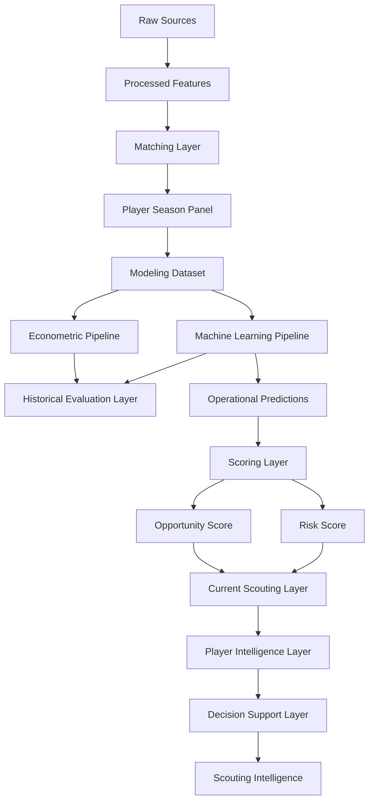

# 🏗️ Decisiones de Esquema y Modelado de Datos

<div align="center">


</div>

---

# 🧠 Objetivo

Este documento describe las decisiones de diseño del esquema de datos utilizadas en la release v1.0.0 — Scouting Intelligence Platform.

Su objetivo es documentar:

- unidad de análisis
- arquitectura de datos
- diseño del dataset
- separación de capas
- prevención de leakage
- tracking experimental
- diseño temporal
- integración con scoring
- integración con player intelligence

---

# 🏗️ Filosofía de diseño

El esquema se ha construido siguiendo principios de:

- modularidad
- reproducibilidad
- trazabilidad
- auditabilidad
- mantenibilidad
- escalabilidad

Principio fundamental:

```text
Separar explícitamente:

Datos
↓
Modelización
↓
Evaluación
↓
Scoring
↓
Player Intelligence
↓
Decision Support
```

---

# ⚙️ Unidad de análisis

Unidad principal:

```text
Jugador – Temporada
```

Cada fila representa:

- un jugador
- una temporada concreta
- un contexto competitivo específico

---

## Justificación

Permite:

- integración multi-fuente
- comparabilidad
- modelización longitudinal
- benchmarking
- scouting reproducible

---

# 📊 Arquitectura conceptual actual



---

# 📂 Arquitectura física

```text
data/

├── raw/
├── interim/
├── processed/
└── external/
```

---

## Separación de responsabilidades

| Elemento | Directorio |
|----------|------------|
| Datos | data/ |
| Lógica | src/ |
| Artefactos | artifacts/ |
| Outputs | reports/ |
| Tracking | mlruns/ |
| Configuración | config/ |
| Dashboard | app/ |

---

# 📦 Separación de capas

La release v1.0.0 introduce una separación explícita entre capas analíticas.

```text
Historical Evaluation Layer
↓
Current Scouting Layer
↓
Player Intelligence Layer
↓
Decision Support Layer
```

---

## Beneficio

Evita mezclar:

- evaluación académica
- recomendaciones operativas
- visualización ejecutiva

---

# 📥 Esquema de datos raw

Objetivo:

Preservar los datos originales.

Fuentes:

```text
data/raw/fbref/
data/raw/transfermarkt/
```

Principio:

```text
Los datos raw nunca se modifican manualmente.
```

---

# 🧪 Esquema de datos procesados

Datasets principales:

| Dataset | Descripción |
|----------|-------------|
| fbref_features.parquet | Features deportivas |
| transfermarkt_features.parquet | Variables de mercado |
| player_season_panel.parquet | Dataset integrado |
| player_season_modeling.parquet | Dataset modelizable |

Formato:

```text
Apache Parquet
```

---

# 🔗 Esquema de integración y matching

Problema:

```text
FBref y Transfermarkt no comparten identificador universal
```

---

## Variables utilizadas

- player_name_normalized
- age
- club
- season

---

## Variables de auditoría

- matching_method
- matching_confidence
- age_diff
- club_score

---

## Thresholds

```yaml
max_age_diff: 1.5
min_club_score: 70
fuzzy_threshold: 92
```

---

## Resultado actual

| Métrica | Valor |
|----------|----------:|
| Observaciones panel | 24.194 |
| Observaciones emparejadas | 21.245 |
| Match Rate | ≈ 88% |

---

## Decisión metodológica

```text
Calidad > Cobertura
```

---

# 📊 Esquema del Modeling Dataset

Dataset principal:

```text
data/processed/player_season_modeling.parquet
```

---

## Cobertura actual

| Métrica | Valor |
|----------|----------:|
| Observaciones | 3.916 |
| Jugadores únicos | 2.138 |
| Ligas | 7 |
| Cobertura temporal | 2019-2020 → 2025-2026 |

---

## Incluye

- variables deportivas
- variables demográficas
- variables contextuales
- growth features
- matching quality features

---

## Excluye

- predicciones
- scoring
- rankings
- outputs derivados
- variables futuras

---

# 🏷️ Diseño de variables categóricas

Variables principales:

| Variable | Tipo |
|----------|------|
| league | Category |
| season | Category |
| position_group | Category |

---

## Position Group

| Grupo | Posiciones |
|----------|------------|
| GK | Porteros |
| DEF | Defensas |
| MID | Centrocampistas |
| ATT | Atacantes |

---

## Uso

### Econometría

```text
Fixed Effects
```

### Machine Learning

```text
Encoding categórico
```

---

# 📈 Diseño de variables numéricas

Variables principales:

- age
- minutes_played
- log_minutes_played
- goals_per90
- assists_per90
- g_a_per90

---

## Growth Features

Introducidas durante Sprint 2.

Variables:

- market_value_growth_prev
- delta_log_market_value_prev
- breakout_indicator
- growth_index
- career_year

---

## Composite Features

Introducidas durante Sprint 3.

Variables:

- finishing_index
- playmaking_index
- growth_index
- experience_index

---

# 🎯 Diseño del target

Variable objetivo:

```python
market_value_eur
```

Transformación:

```python
log_market_value_eur
```

---

## Justificación

Mejora:

- estabilidad
- linealidad
- robustez frente a outliers

---

## Decisión

El sistema modela:

```text
Valor esperado de mercado
```

No modela:

- precio de transferencia
- salario
- valor contractual

---

# 📂 Separación Dataset vs Outputs

Dataset base:

```text
Información disponible antes de modelizar
```

Outputs:

- predicciones
- scores
- rankings
- explainability
- scouting reports

---

## Justificación

Evita:

- leakage
- contaminación analítica
- dependencia circular

---

# 💡 Variables derivadas

Variables derivadas:

- log_market_value_eur
- log_minutes_played
- g_a_per90

---

# 🎯 Variables de Scoring

Introducidas desde Sprint 5.

Variables:

- predicted_market_value_eur
- market_value_gap_eur
- inefficiency_score
- growth_score
- confidence_score
- opportunity_score

---

## Sprint 10

Nuevas variables:

### risk_score

Cuantificación de incertidumbre.

### risk_level

Clasificación:

```text
Low
Medium
High
```

### risk_adjusted_opportunity_score

Priorización ajustada por riesgo.

---

## Decisión crítica

Las variables de scoring:

```text
NO forman parte del dataset base
```

---

# 🧠 Player Intelligence Schema

Introducido en Sprint 10.1.

Objetivo:

Transformar scoring en análisis individuales.

---

## Radar Features

MID / ATT

- minutes_played
- goals_per90
- assists_per90
- g_a_per90
- growth_score
- confidence_score

---

DEF

- tackles_per90
- interceptions_per90
- blocks_per90

---

GK

- save_pct
- clean_sheets

---

## Benchmarking Features

- radar_percentile
- benchmark_group

---

## Narrative Features

- opportunity_score
- risk_score
- growth_score
- confidence_score

---

# 🧪 Experiment Tracking Schema

Herramienta:

```text
MLflow
```

Directorio:

```text
mlruns/
```

---

## Elementos registrados

### Parámetros

- features
- target
- hyperparameters

### Métricas

- RMSE
- MAE
- R²

### Artefactos

- modelos
- predicciones
- explainability

---

# ⚙️ Configuración Centralizada

Directorio:

```text
config/
```

Archivos:

- config.yaml
- paths.yaml
- project.yaml
- matching.yaml
- features.yaml
- modeling.yaml

---

## Beneficios

- reproducibilidad
- mantenibilidad
- auditoría
- comparación de experimentos

---

# 🛡️ Prevención de Leakage

Principio:

```text
Toda variable debe existir
en el momento real de decisión.
```

---

## Variables excluidas

- market_value_next_eur
- future_minutes
- future_xG
- predicted_market_value_eur
- inefficiency_score
- opportunity_score
- risk_score
- run_id
- experiment_id

---

## Leakage controlado

- temporal leakage
- target leakage
- train-test leakage
- scoring leakage

---

# ⏳ Diseño temporal

## Validación histórica

| Split | Temporadas |
|----------|------------|
| Train | 2019-2020 → 2024-2025 |
| Current Scouting | 2025-2026 |

---

## Sprint 10.3

Nueva separación:

```text
Historical Evaluation Layer
≠
Current Scouting Layer
```

Esta decisión constituye uno de los cambios metodológicos más relevantes del proyecto.

---

# 📦 Gestión de artefactos

## artifacts/

Contiene:

- modelos
- predicciones
- feature importance
- encoders

---

## reports/

Contiene:

- tablas
- rankings
- scouting reports
- visualizaciones

---

## mlruns/

Contiene:

- runs
- métricas
- parámetros
- artefactos experimentales

---

# ⚖️ Trade-offs metodológicos

| Trade-off | Decisión |
|----------|-----------|
| Cobertura vs precisión | Priorizar precisión |
| Matching agresivo vs conservador | Conservador |
| Dataset grande vs fiable | Fiable |
| Complejidad vs interpretabilidad | Equilibrio |
| Evaluación histórica vs operación | Separación Sprint 10 |

---

# 🚀 Evolución prevista

## Sprint 11

Advanced Football Radar

Nuevos bloques:

- Shooting
- Defense
- Misc
- Playing Time

---

## Sprint 12

Understat

Nuevas variables:

- xG
- xA
- xGChain

---

## Sprint 13

Advanced Modeling

- position-specific models
- ensemble models
- similarity engine

---

# 🧠 Conclusión

La principal evolución introducida en Sprint 10 consiste en transformar un esquema orientado exclusivamente a modelización en una arquitectura preparada para Scouting Intelligence.

La separación explícita entre:

```text
Historical Evaluation Layer
↓
Current Scouting Layer
↓
Player Intelligence Layer
↓
Decision Support Layer
```

permite mantener rigor metodológico, evitar contaminación entre etapas y aproximar el sistema a arquitecturas utilizadas en departamentos profesionales de Football Analytics.
