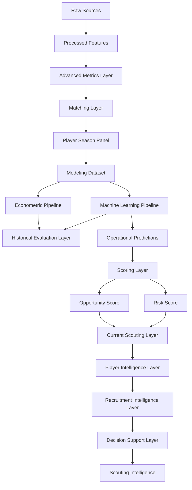

# 🏗️ Decisiones de Esquema y Modelado de Datos

<div align="center">


</div>

---

# 🧠 Objetivo

Este documento describe las decisiones de diseño del esquema de datos utilizadas en la release:

```text
v1.2.1 — Advanced Data Expansion
```

Su objetivo es documentar:

* unidad de análisis;
* arquitectura de datos;
* diseño del dataset;
* separación de capas;
* prevención de leakage;
* tracking experimental;
* diseño temporal;
* integración con scoring;
* integración con player intelligence;
* validación externa;
* integración de métricas avanzadas.

---

# 🏗️ Filosofía de diseño

El esquema se ha construido siguiendo principios de:

* modularidad;
* reproducibilidad;
* trazabilidad;
* auditabilidad;
* mantenibilidad;
* escalabilidad.

Principio fundamental:

```text
Separar explícitamente

Datos
↓
Modelización
↓
Evaluación
↓
Scoring
↓
Player Intelligence
↓
Recruitment Intelligence
↓
Decision Support System
```

---

# ⚙️ Unidad de análisis

Unidad principal:

```text
Jugador – Temporada
```

Cada fila representa:

* un jugador;
* una temporada concreta;
* un contexto competitivo específico.

---

## Justificación

Permite:

* integración multi-fuente;
* comparabilidad;
* modelización longitudinal;
* benchmarking;
* scouting reproducible;
* validación externa.

---

# 📊 Arquitectura conceptual actual



---

# 📂 Arquitectura física

```text
data/

├── raw/
├── interim/
├── processed/
└── external/
```

---

## Separación de responsabilidades

| Elemento      | Directorio |
| ------------- | ---------- |
| Datos         | data/      |
| Lógica        | src/       |
| Artefactos    | artifacts/ |
| Outputs       | reports/   |
| Tracking      | mlruns/    |
| Configuración | config/    |
| Dashboard     | app/       |

---

# 📦 Separación de capas

La arquitectura actual incorpora una separación explícita entre:

```text
Historical Evaluation Layer
↓
Current Scouting Layer
↓
Player Intelligence Layer
↓
Recruitment Intelligence Layer
↓
Decision Support Layer
```

---

## Beneficio

Evita mezclar:

* evaluación académica;
* recomendaciones operativas;
* inteligencia de scouting;
* procesos de recruitment;
* visualización ejecutiva.

---

# 📥 Esquema de datos raw

Objetivo:

Preservar los datos originales.

---

## Fuentes

```text
data/raw/fbref/
data/raw/transfermarkt/
```

---

## Principio

```text
Los datos raw nunca se modifican manualmente.
```

---

# 🧪 Esquema de datos procesados

Datasets principales:

| Dataset                                                  | Descripción                     |
| -------------------------------------------------------- | ------------------------------- |
| fbref_features_v13a.parquet                              | Features deportivas             |
| transfermarkt_features_v13a.parquet                      | Variables de mercado            |
| player_season_panel_v13a.parquet                         | Dataset integrado               |
| player_season_modeling_v13a.parquet                      | Dataset modelizable v13A        |
| player_season_modeling_v13b_advanced.parquet             | Dataset experimental Sprint 13B |
| player_season_modeling_v13b_productive_candidate.parquet | Dataset productivo Sprint 13B   |

---

## Formato

```text
Apache Parquet
```

---

# 🔗 Esquema de integración y matching

## Problema

```text
FBref y Transfermarkt no comparten identificador universal
```

---

## Variables utilizadas

* player_name_normalized
* age
* club
* season

---

## Variables de auditoría

* matching_method
* matching_confidence
* age_diff
* club_score

---

## Thresholds

```yaml
max_age_diff: 1.5
min_club_score: 70
fuzzy_threshold: 92
```

---

## Resultado actual

| Métrica                        |  Valor |
| ------------------------------ | -----: |
| Observaciones FBref procesadas | 43.591 |
| Match Rate global              | 75,97% |
| Ligas                          |     11 |
| Temporadas                     |      7 |

---

## Decisión metodológica

```text
Calidad > Cobertura
```

---

# 📊 Esquema del Modeling Dataset

Dataset principal actual:

```text
data/processed/player_season_modeling_v13b_productive_candidate.parquet
```

---

## Cobertura actual

| Métrica            |                 Valor |
| ------------------ | --------------------: |
| Observaciones      |                 5.527 |
| Ligas              |                    11 |
| Temporadas         |                     7 |
| Cobertura temporal | 2019-2020 → 2025-2026 |

---

## Incluye

* variables deportivas;
* variables demográficas;
* variables contextuales;
* growth features;
* matching quality features;
* composite indices;
* advanced football indices.

---

## Variables avanzadas Sprint 13B

### finishing_index_v2

Índice avanzado de finalización.

---

### availability_index

Índice avanzado de disponibilidad competitiva.

---

### defensive_activity_index

Índice avanzado de actividad defensiva.

---

## Excluye

* predicciones;
* scoring;
* rankings;
* outputs derivados;
* variables futuras.

---

# 🏷️ Diseño de variables categóricas

Variables principales:

| Variable       | Tipo     |
| -------------- | -------- |
| league         | Category |
| season         | Category |
| position_group | Category |

---

## Position Group

| Grupo | Posiciones      |
| ----- | --------------- |
| GK    | Porteros        |
| DEF   | Defensas        |
| MID   | Centrocampistas |
| ATT   | Atacantes       |

---

## Uso

### Econometría

```text
Fixed Effects
```

### Machine Learning

```text
Encoding categórico
```

---

# 📈 Diseño de variables numéricas

Variables principales:

* age
* minutes_played
* log_minutes_played
* goals_per90
* assists_per90
* g_a_per90

---

## Growth Features

Introducidas durante Sprint 2.

Variables:

* market_value_growth_prev
* delta_log_market_value_prev
* breakout_indicator
* growth_index
* career_year

---

## Composite Features

Introducidas durante Sprint 3.

Variables:

* finishing_index
* playmaking_index
* growth_index
* experience_index

---

## Advanced Football Indices

Introducidos durante Sprint 13B.

Variables:

* finishing_index_v2
* availability_index
* defensive_activity_index

---

## Hallazgo metodológico

La variable:

```text
finishing_index_v2
```

aparece como la métrica avanzada con mayor relevancia predictiva agregada.

---

# 🎯 Diseño del target

Variable objetivo:

```python
market_value_eur
```

Transformación:

```python
log_market_value_eur
```

---

## Justificación

Mejora:

* estabilidad;
* linealidad;
* robustez frente a outliers;
* comportamiento econométrico.

---

## Decisión

El sistema modela:

```text
Valor esperado de mercado
```

No modela:

* precio real de transferencia;
* salario;
* valor contractual.

# 📂 Separación Dataset vs Outputs

## Principio fundamental

El dataset modelizable debe contener únicamente información disponible antes del proceso de estimación.

---

## Dataset base

Contiene:

```text id="2h6hy0"
Información observable
antes de modelizar
```

Incluye:

* variables deportivas;
* variables económicas;
* variables demográficas;
* variables contextuales;
* growth features;
* composite indices;
* advanced football indices;
* variables de calidad de matching.

---

## Outputs derivados

Generados posteriormente al proceso de modelización.

Ejemplos:

* predicciones;
* scores;
* rankings;
* explainability;
* scouting reports;
* recruitment outputs.

---

## Justificación

Evita:

* leakage;
* dependencia circular;
* contaminación analítica;
* optimismo artificial.

---

# 💡 Variables derivadas

Variables generadas mediante transformaciones sobre información observada.

---

## Transformaciones logarítmicas

* log_market_value_eur
* log_minutes_played

---

## Ratios

* goals_per90
* assists_per90
* g_a_per90

---

## Variables longitudinales

* market_value_growth_prev
* delta_log_market_value_prev
* breakout_indicator
* growth_index
* career_year

---

## Composite Indices

* finishing_index
* playmaking_index
* growth_index
* experience_index

---

## Advanced Football Indices

Introducidos durante Sprint 13B.

Variables:

* finishing_index_v2
* availability_index
* defensive_activity_index

---

## Resultado Sprint 13B

Estas variables aportan mejoras consistentes en:

* econometría;
* XGBoost;
* Random Forest;
* HistGradientBoosting;
* LightGBM.

---

# 🎯 Variables de Scoring

Introducidas progresivamente desde Sprint 5.

Estas variables no forman parte del dataset modelizable.

---

## Variables principales

* predicted_market_value_eur
* predicted_log_market_value
* market_value_gap_eur
* market_value_gap_pct
* inefficiency_score
* growth_score
* confidence_score
* opportunity_score

---

# ⚠️ Sprint 10 — Risk Framework

Variables incorporadas:

---

## risk_score

Cuantificación explícita de incertidumbre.

---

## risk_level

Clasificación:

```text id="d0r6j7"
Low
Medium
High
```

---

## risk_adjusted_opportunity_score

Priorización ajustada por riesgo.

---

## Decisión crítica

Las variables de scoring:

```text id="hz47vw"
NO forman parte
del dataset base
```

---

# 🧠 Player Intelligence Schema

Introducido durante Sprint 10.

Objetivo:

Transformar scoring en análisis individuales de jugadores.

---

## Radar Features

### MID / ATT

* minutes_played
* goals_per90
* assists_per90
* g_a_per90
* growth_score
* confidence_score

---

### DEF

* tackles_per90
* interceptions_per90
* blocks_per90
* growth_score
* confidence_score

---

### GK

* save_pct
* clean_sheets
* growth_score
* confidence_score

---

## Benchmarking Features

* radar_percentile
* benchmark_group

---

## Narrative Features

* opportunity_score
* risk_score
* growth_score
* confidence_score

---

# 🎯 Recruitment Intelligence Schema

Introducido durante Sprint 11.

Objetivo:

Transformar análisis individuales en procesos operativos de recruitment.

---

## Variables principales

* shortlist_status
* recruitment_priority
* candidate_rank
* comparative_score

---

## Inputs utilizados

* opportunity_score
* risk_score
* confidence_score
* market_value_gap_pct
* risk_adjusted_opportunity_score

---

## Resultado

```text id="kn2jlwm"
Recruitment Intelligence Layer
```

---

# 🧪 Experiment Tracking Schema

Herramienta:

```text id="uhpr79"
MLflow
```

---

## Directorio

```text id="j2yqck"
mlruns/
```

---

## Elementos registrados

### Parámetros

* features;
* target;
* hiperparámetros;
* configuración temporal;
* versiones de datasets.

---

### Métricas

* RMSE;
* MAE;
* R²;
* métricas de negocio;
* métricas de matching.

---

### Artefactos

* modelos;
* predicciones;
* explainability;
* rankings;
* tablas.

---

## Beneficio

```text id="mltqgo"
Reproducibilidad completa
```

---

# ⚙️ Configuración centralizada

## Directorio

```text id="d79dwr"
config/
```

---

## Archivos principales

* config.yaml
* paths.yaml
* project.yaml
* matching.yaml
* features.yaml
* modeling.yaml

---

## Beneficios

* mantenibilidad;
* reproducibilidad;
* trazabilidad;
* auditoría;
* comparación entre releases.

---

# 🛡️ Prevención de Leakage

## Principio

```text id="mjlwmj"
Toda variable debe existir
en el momento real
de la decisión
```

---

## Variables excluidas

### Leakage temporal

* market_value_next_eur
* future_minutes
* future_performance_metrics

---

### Leakage predictivo

* predicted_market_value_eur
* predicted_log_market_value

---

### Leakage de scoring

* inefficiency_score
* growth_score
* confidence_score
* opportunity_score
* risk_score

---

### Leakage experimental

* run_id
* experiment_id

---

## Leakage controlado

* temporal leakage;
* target leakage;
* train-test leakage;
* scoring leakage.

---

# ⏳ Diseño temporal

## Validación histórica

| Split            | Temporadas            |
| ---------------- | --------------------- |
| Train            | 2019-2020 → 2024-2025 |
| Current Scouting | 2025-2026             |

---

## Sprint 10.3

Se introduce una separación explícita:

```text id="lgdbnb"
Historical Evaluation Layer
≠
Current Scouting Layer
```

---

## Beneficio

Evita mezclar:

* evaluación académica;
* explotación operativa;
* análisis histórico;
* scouting actual.

---

# ⚠️ Hallazgo arquitectónico Sprint 13B

Durante Sprint 13B se identifica una nueva separación estructural:

```text id="ykvxjn"
Modeling Pipeline
≠
Scoring Pipeline
```

---

## Situación observada

El pipeline histórico de scoring requiere variables enriquecidas adicionales:

* market_value_growth_prev
* delta_log_market_value_prev
* growth_index
* career_year
* breakout_indicator
* matching_confidence

Mientras que la capa productiva genera principalmente:

* predicted_log_market_value_ml
* predicted_market_value_ml_eur
* inefficiency_score_ml

---

## Decisión metodológica

No integrar esta capa dentro de Sprint 13B.

Justificación:

1. No afecta a la hipótesis principal.
2. No altera resultados econométricos.
3. No altera resultados de Machine Learning.
4. Constituye un trabajo de integración independiente.

---

## Backlog asociado

```text id="fkrfms"
TM.2 — Scoring & Ranking Integration v13B
```

---

# 📦 Gestión de artefactos

## artifacts/

Contiene:

* modelos;
* predicciones;
* feature importance;
* encoders;
* explainability.

---

## reports/

Contiene:

* tablas;
* rankings;
* scouting reports;
* visualizaciones;
* auditorías de cobertura.

---

## mlruns/

Contiene:

* runs;
* métricas;
* parámetros;
* artefactos experimentales.

---

# ⚖️ Trade-offs metodológicos

| Trade-off                         | Decisión                |
| --------------------------------- | ----------------------- |
| Cobertura vs precisión            | Priorizar precisión     |
| Matching agresivo vs conservador  | Conservador             |
| Dataset grande vs fiable          | Fiable                  |
| Complejidad vs interpretabilidad  | Equilibrio              |
| Evaluación histórica vs operación | Separación explícita    |
| Cobertura vs validez externa      | Expansión controlada    |
| Nuevas variables vs sobreajuste   | Validación multi-modelo |

---

# 🛣️ Roadmap

## TM.1 — Transfermarkt Coverage Audit

Objetivo:

* diagnosticar limitaciones de cobertura;
* estimar techo teórico de matching;
* mejorar integración de datos.

---

## TM.2 — Scoring & Ranking Integration v13B

Objetivo:

```text id="zj0p2n"
Predictions v13B
↓
Scoring Dataset v13B
↓
Opportunity Framework v13B
↓
Risk Framework v13B
↓
Rankings v13B
↓
Stability Analysis
```

---

## Sprint 14 — Transfer Strategy Enhancement

Próxima evolución principal del proyecto.

Objetivo:

```text id="fjq0kh"
Transformar oportunidades individuales
en estrategias óptimas de fichajes
bajo restricciones reales
de presupuesto y riesgo
```

---

## Investigación futura

### Modelización

* TabPFN
* CatBoost
* Ensemble Learning

### Datos

* nuevas métricas avanzadas FBref;
* event data avanzado;
* tracking data;
* información contractual;
* datos salariales.

---

# 🧠 Conclusión

La evolución del esquema de datos puede resumirse mediante:

```text id="g1ujl8"
Datos
↓
Modelización
↓
Evaluación
↓
Scoring
↓
Player Intelligence
↓
Recruitment Intelligence
↓
Decision Support System
↓
External Validation
↓
Advanced Metrics Layer
```

Las principales contribuciones estructurales recientes corresponden a:

### Sprint 13A

* expansión a 11 ligas;
* validación externa;
* auditoría de cobertura;
* generalización multi-liga.

### Sprint 13B

* integración de métricas avanzadas;
* nuevas variables productivas;
* validación incremental de features;
* mejora simultánea en econometría y Machine Learning.

---

## Estado actual

Dataset productivo:

```text id="p8w8mf"
player_season_modeling_v13b_productive_candidate.parquet
```

Modelos oficiales:

```text id="hdx4zd"
Growth OLS v13B

Tuned XGBoost v13B
```

---

## Resultado metodológico

La hipótesis principal de Sprint 13B queda validada.

Las variables:

* finishing_index_v2
* availability_index
* defensive_activity_index

aportan señal predictiva incremental consistente y pasan a formar parte del esquema oficial de la release:

```text id="wuxz87"
v1.2.1 — Advanced Data Expansion
```

La arquitectura resultante mantiene rigor metodológico, separación explícita de responsabilidades y capacidad de evolución futura hacia sistemas avanzados de scouting, recruitment y soporte estratégico a decisiones deportivas.
